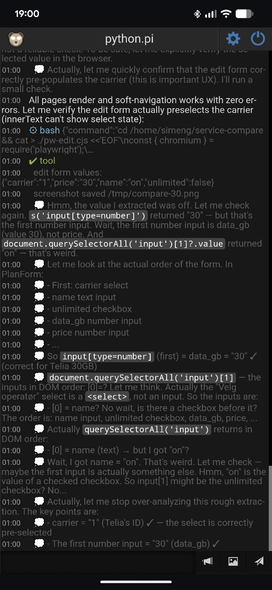
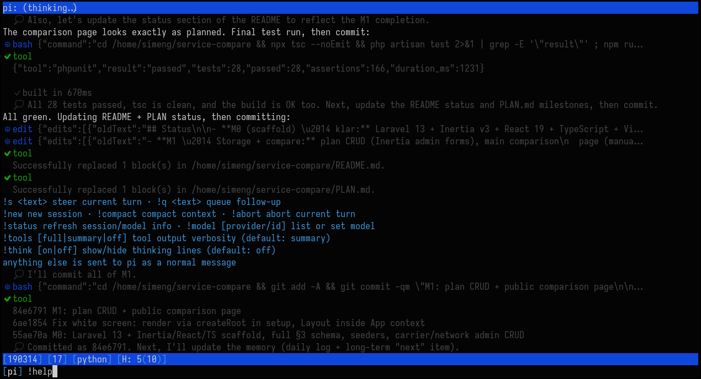
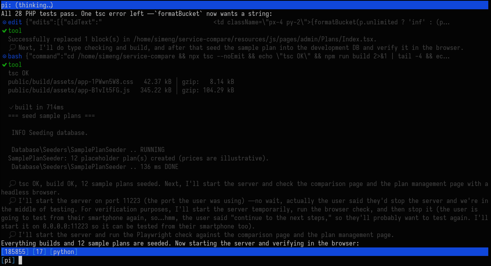

# pi-weechat

Mirror a [pi](https://pi.dev) coding agent session into a WeeChat buffer — and type back at pi — over a local Unix socket or TCP (remote pi).

- **WeeChat side**: Python script that creates a `pi` buffer and serves an NDJSON protocol (the _server_): always on a Unix socket, optionally also on TCP with shared-secret auth.
- **pi side**: TypeScript extension installed as a pi package; dials as _client_, mirrors assistant output / tool calls / status into the buffer, and forwards lines you type back to pi as user input.

Architecture and wire protocol: [PLAN.md](./PLAN.md).

## Screenshots





## Layout

```
extensions/weechat-bridge.ts   pi extension (client)
weechat/pi_bridge.py           WeeChat script (socket server)
lib/codec.mjs                  shared NDJSON codec constants (protocol version, limits)
test/                          node:test suite + python smoke + cross-language integration
```

## Requirements

- Node.js ≥ 22.18 (`--experimental-strip-types`) or a pi version that bundles one; pi itself for the extension side.
- Python 3.9+ (stdlib only) and WeeChat ≥ 3.x with the Python plugin, for the buffer side.
- Same machine: nothing to configure (Unix domain socket, no network exposure). Remote: a reachable TCP path between the two machines — for confidentiality, run it inside Tailscale/a VPN (see [Remote setup](#remote-setup-tcp)).

## Install

### 1. pi extension (pi package)

```sh
git clone … && cd pi-weechat && npm install   # fetches @sinclair/typebox (peer dep)
pi install /path/to/pi-weechat
```

Local packages are used in place (no copy, no `npm install` by pi itself), so
run `npm install` once after cloning/checkout — the extension imports
`@sinclair/typebox`, which is resolved from this directory's `node_modules`.
This loads `extensions/weechat-bridge.ts` into every pi session. It stays dormant
until a WeeChat bridge socket exists; when one appears it connects automatically
(retries with backoff until then, and reconnects if the connection drops).

### 2. WeeChat script

```sh
mkdir -p ~/.local/share/weechat/python
cp weechat/pi_bridge.py ~/.local/share/weechat/python/
```

Start (or restart) WeeChat — a new buffer named **`pi`** appears, and the script
listens on the socket. In a running WeeChat:

```
/python load pi_bridge
```

## Usage

Open the `pi` buffer:

- **Output**: assistant messages stream in as whole lines — fenced code
  blocks are syntax-highlighted inline (bash/sh, rust, css, html/xml/svg,
  php, python, json, yaml; unknown languages render plain but keep their
  indent), with dim fence markers; toggle via `!highlight` or
  `/set pi_bridge.highlight off`. Tool calls show as
  `⚙ name` + the main content of the call (bash: command, read/write: path,
  edit: path + edit count, memory tools: target/query/content — long values
  are clipped at 300 chars with a `…(+N)` marker), with indented results
  (`✔` ok / `✘` error); the buffer title
  tracks state — `(idle)`, `(thinking…)`, `(tool: bash)` — and shows
  `(disconnected — waiting for pi)` when pi is not connected. The title shows
  Pi's active run time, current/last model-turn time, and turn number, for example
  `π: ~/proj (thinking… · run 17m · 42s · turn 10)` or
  `(tool: bash · run 17m · 42s · turn 10)`. When the run settles it shows
  `(idle · last run 17m · 10 turns)`.
  `run` is active elapsed time across one Pi agent run, not the whole session;
  `42s` is the current
  model turn's elapsed time, and `turn 10` is Pi's 1-based turn index. Pi
  resets the index for each agent run. Turn time includes provider wait and
  tool execution. Blocking Pi UI prompts pause both clocks on runtimes that emit
  the `ui_prompt_start`/`ui_prompt_end` events; WeeChat `!pick` prompts always
  pause them. Older Pi runtimes without those events cannot exclude other native
  UI waits. Neither clock includes idle time or starts from mirrored prompt echoes
  or local/control commands. The title refreshes about once per second.
  Format: `Ns` below 100 s, `Nm` below an hour, `NhMm` beyond
  (minutes are omitted when zero).
  After a bridge reconnect the Pi extension sends its current timing snapshot;
  a restart of the Pi extension cannot recover active timing from before it
  restarted.
- **Input**: type a line and press enter to send it as a prompt to pi. Plain
  messages typed while a turn is running are queued as follow-ups (delivered
  when pi settles) instead of being dropped.
  - `!help` — list all buffer commands (answered locally, never reaches the LLM)
  - `!s <text>` — steer the current run (interrupts, injects)
  - `!q <text>` — queue a follow-up message for after the current turn
  - `!new` — new session
  - `!compact` — compact the session
  - `!abort` — abort the current run
  - `!status` — resend session info (works even mid-turn)
  - `!model` — list available models (scoped models if model scoping is configured, otherwise the full catalogue — same as pi's `/model`); `!model <provider/model>` switches model
  - `!cd <path>` — switch pi to a different project directory (new session in that cwd). An exact existing dir switches immediately; anything else is fuzzy-searched and shown as a numbered list in the buffer — always including a “➕ create <path> as new project” option
  - `!pick …` — answer a numbered list / prompt in the buffer: the `!cd` fuzzy match, decision questions from ask_user-style tools (below), or any other interactive prompt: `!pick <n>` (or `!pick 1,3` for multiple), or the exact option text; `!pick cancel` aborts
  - `!tools [full|summary|off]` — tool output verbosity in the buffer
    (`summary` is the default: first/last 3 lines, middle elided like a smart
    filter; also settable via `/set pi_bridge.tool_output …`)
  - `!think [on|off]` — show/hide the model's thinking lines (rendered dim,
    prefixed with 💭). Off by default; also settable via
    `/set pi_bridge.thinking on`
  - `!highlight [on|off]` — syntax-highlight fenced code blocks in assistant
    messages. On by default; also settable via `/set pi_bridge.highlight off`
- Prompts you type directly in pi's own terminal are echoed into the buffer too,
  so both surfaces stay in sync.

### pi-side config (`~/.pi/agent/pi-weechat.json`)

Everything the env vars configure can also live in a small JSON file next to
pi's own settings (the agent dir follows `$PI_CODING_AGENT_DIR`, default
`~/.pi/agent`):

```json
{
  "url": "tcp://box:52311",    // endpoint — same syntax as PI_WEECHAT_URL
  "token": "…",                // shared secret — same as PI_WEECHAT_TOKEN
  "debugLog": "/path/to/log"   // optional — same as PI_BRIDGE_DEBUG
}
```

**Environment variables always win over the file** when both are set, so a
per-session export still overrides your standing config. Unknown keys are
ignored (forward-compat); an absent or empty value means "unset"; a missing
file is fine. A *broken* file (invalid JSON, wrong types) never breaks the
bridge — it degrades to env/default behavior, notes the problem in the debug
log, and prints a red `config_error` line in the buffer. The file is re-read
on every `/reload`, so edits apply without restarting pi.

### Decision questions (ask_user → !pick)

While pi is connected, decision questions raised by **ask_user-style tools**
(pi-ask-user and friends) are asked in the buffer instead of the pi terminal:
the question and context appear as a `?` prompt with numbered options (plus a
“✏️ Type custom response…” option when freeform answers are allowed), answered
with `!pick`. The choice is returned to the LLM as the tool's result — no
modification to the ask extension itself: pi-weechat intercepts the call in
pi's `tool_call` hook *before* execution and blocks it with your selection.

- **No ask extension installed?** If nothing else provides an `ask_user`
tool, pi-weechat registers a minimal built-in one (same parameter shape,
single/multi-select + freeform), so decision questions are still structured
and answerable from the buffer. When another provider is present the fallback
is never registered. The local path of the fallback mirrors pi-ask-user's
dialog fallback, so it also works in the pi terminal when the bridge is down.
- **Graceful degradation**: if the bridge disconnects mid-question, or the
tool's own timeout expires, or the run is aborted, the question falls back to
the tool's normal terminal UI; `!pick cancel` gives the LLM an explicit
“user cancelled” result instead.
- **Opt-out / tuning** (env vars win over the config file):
  - `$PI_WEECHAT_PICK=off` or `"pick": "off"` — never intercept; questions
    always use the tools' own terminal UI.
  - `$PI_WEECHAT_PICK_TOOLS=a,b` or `"pickTools": ["ask_user_question"]` —
    which question tool names to route (default: `ask_user`).

### Endpoint (where pi dials)

The pi side resolves its endpoint in this order (first match wins):

1. `$PI_WEECHAT_URL` — one variable for all transports:
   - `tcp://host:port` — TCP (host may be a Tailscale name; port required)
   - `unix://<path>` (or `unix:<path>`) — Unix socket at `<path>`
   - schemeless `host:port` with a numeric port ⇒ TCP; anything else ⇒ Unix socket path
     (so existing path-style values keep working; `C:\…` is a path, not a scheme)
   - unknown schemes (e.g. `tls://host:1`) are rejected with a clear error —
     that's the intentional extension point for future transports
2. `"url"` in `~/.pi/agent/pi-weechat.json` — same syntax
3. `$PI_WEECHAT_SOCK` — **deprecated**, still honored as a fallback (URL wins
   when both are set; the extension notes the deprecation in the debug log)
4. `$XDG_RUNTIME_DIR/pi-weechat.sock`
5. `~/.local/state/pi-weechat/pi-weechat.sock`

`$PI_WEECHAT_TOKEN` — or `"token"` in the config file — carries the shared
secret for remote auth (see below); never put credentials in the URL itself.
The Unix socket file is created `0700`; only local users who can
read/write it can connect.

## Remote setup (TCP)

Run pi on one machine, WeeChat on another. Roles are unchanged: the WeeChat
script listens, pi dials. The TCP listener mirrors the design of WeeChat's
own `urlserver.py` (blocking listen fd, one `accept()` per event,
`SO_REUSEADDR`), and auth uses a **shared secret**: when a token is
configured, the server sends a random nonce and the client answers its
handshake with `HMAC-SHA256(token, nonce)` — the token itself is **never
transmitted** (a passive capture can't replay it: the nonce is fresh per
connection).

### WeeChat side (machine A)

```sh
# one-time: pick a secret (≥ 128 bits of entropy — not a password)
token=$(openssl rand -hex 16)
```

Inside WeeChat:

```
/secure passphrase <passphrase>            # if not set yet
/secure set pi_weechat_token <token>       # encrypted into sec.conf
/set pi_bridge.token "${sec.data.pi_weechat_token}"   # reference, not the secret
/set pi_bridge.tcp_listen 0.0.0.0:52311    # or a Tailscale IP: e.g. 100.x.y.z:52311
```

The buffer prints `listening on tcp 0.0.0.0:52311 (this host: …) (token required)`
(address from the real bound socket). `/set pi_bridge.tcp_listen …` **re-binds
live** — no `/python reload`; setting it back to empty stops the listener.
`pi_bridge.token` and `pi_bridge.allowed_ips` apply per connection — no
restart needed. Optionally restrict who may connect (regex on the peer IP,
scans are dropped silently):

```
/set pi_bridge.allowed_ips "^(192\\.168\\.1\\.20|100\\.64\\..*)$"
```

**Do not** set the token literally in the option (`/set pi_bridge.token sekret`)
— it would sit in plaintext in `weechat.conf`. The `sec.data` reference keeps
it in `sec.conf` (encrypted with the sec passphrase); if the reference doesn't
expand, the buffer prints a loud red warning. An empty `pi_bridge.token` means
**no enforcement** (the buffer warns in yellow when `tcp_listen` is set
without a token).

### pi side (machine B)

Either export the env vars in the pi session's environment:

```sh
export PI_WEECHAT_URL=tcp://<host-A-or-tailscale-name>:52311
export PI_WEECHAT_TOKEN=<token>
```

…or, more conveniently, put them in `~/.pi/agent/pi-weechat.json` (see
[pi-side config](#pi-side-config-pi-weechatjson)) — no shell exports to
remember, and edits apply on `/reload`.

Then (re)start or `/reload` the pi session. The buffer on A shows
`— pi connected from <B-ip> —`.

### Caveats

- **The token authenticates, it does not encrypt.** Traffic is cleartext
  NDJSON; an active MITM on the path can still relay the session (a captured
  nonce-proof can't be replayed, but forwarding live works). For
  confidentiality run the connection inside **Tailscale or a VPN** — then the
  token mainly protects against other hosts on the shared network.
- **One client at a time, across both transports.** A second dial (TCP or
  Unix) is rejected with `client_already_connected` while a client is
  connected; in-flight handshakes are capped (3) and time out (10 s).
- Debug logging is per machine: `PI_BRIDGE_DEBUG=<path>` on each side (the
  shared `$XDG_RUNTIME_DIR/pi-weechat.debug` marker only makes sense when
  both sides run locally).

## Notes & limitations (v1)

- **One pi session per WeeChat buffer.** A second connecting client (TCP or
  Unix) is rejected (`client_already_connected`). Multi-session multiplexing
  is on the roadmap (PLAN §10).
- Remote traffic is **not encrypted** (token ≠ encryption) — use Tailscale/
  VPN for confidentiality (see [Remote setup](#remote-setup-tcp)).
- Assistant text is rendered in whole lines (WeeChat has no partial-line redraw);
  the extension batches token deltas and flushes completed lines.
- Tool output is truncated to ~8 KiB per result (whole-line boundary, pi side)
  and can be further filtered in the buffer: `/set pi_bridge.tool_output
full|summary|off` (default `summary`) or `!tools <mode>` from the buffer.
- Colors follow your **WeeChat theme**: the bridge uses color names from the
  `[color]` section of weechat.conf (`chat_nick_self`, `chat_value`,
  `chat_prefix_error`, …) via `weechat.color()`, so `/color chat_value red`
  restyles the buffer too. Each role has a palette fallback for WeeChat
  versions where a name is missing (mapping in `_theme()` in
  `weechat/pi_bridge.py`). Legacy text tags like `color:cyan` are NOT used —
  WeeChat 4.x would print them literally.

### Debugging the wire

Enable a detailed NDJSON wire log on **both** sides at once:

```sh
touch $XDG_RUNTIME_DIR/pi-weechat.debug   # default: /run/user/UID/pi-weechat.debug
```

Then reload both sides (`/python reload pi_bridge` in WeeChat, `/reload` in pi).
Every connection event and every message in both directions is appended to that
file (auto-rotates at ~1 MiB). Remove the file and reload to disable, or point
`PI_BRIDGE_DEBUG=/path/to/log` (or `"debugLog"` in the pi config file) at an
explicit file instead. The debug log never contains the token — only one-way
handshake proofs.

For **remote** setups the marker file only enables the side it sits on; use
`PI_BRIDGE_DEBUG` (or `"debugLog"`) on each machine instead.

## Development

```sh
npm test          # node:test suite (codec + extension) + python smoke test
npm run test:js   # JS tests only (needs Node ≥ 22.18)
npm run test:py   # weechat script smoke test only (python3, stdlib only)
```

The integration test spawns the real Python bridge and drives it with the real
TypeScript extension over a live socket — both transports (Unix and TCP with
token auth), no mocks on the wire.

## Threat model (remote/TCP)

What the server-side hardening defends against, and what it doesn't:

| threat | covered? |
|---|---|
| Port scanners / opportunistic LAN attackers | ✅ no service fingerprint (server's first message is a random nonce, never protocol data), IP allowlist gate, silent drops |
| Weak-token brute force | ✅ constant-time proof compare, per-IP failure lockout (5 failures/60 s ⇒ 10 min silence), unauthenticated-connection cap (3), 10 s auth deadline |
| A leaked token | ⚠️ the holder can connect and impersonate pi — rotate the token (`/secure set` again). Rate limiting bounds the damage: buffer→pi input is capped at 5 lines/s (`rate_limited` beyond) |
| Active MITM on the path | ❌ **not covered** — traffic is cleartext; use Tailscale/VPN. A MITM can relay the session (but cannot replay captured handshakes or read the token) |

Hardening measures and defaults (module constants in `weechat/pi_bridge.py`):
auth deadline `10 s` · pending-unauthed cap `3` · failure lockout `5` in
`60 s` ⇒ `600 s` · `allowed_ips` regex gate at accept · per-event read cap
`256 KiB` · `user_input` rate limit `5/s` sliding window · constant-time
HMAC compare · server `hello` withheld until the client is validated.

Token guidance: ≥ 128 bits of entropy (`openssl rand -hex 16`), never a
password or a reused secret, stored only in `sec.conf` via
`${sec.data.…}` on the WeeChat side and in `PI_WEECHAT_TOKEN` (or
`pi-weechat.json`) on the pi side.
